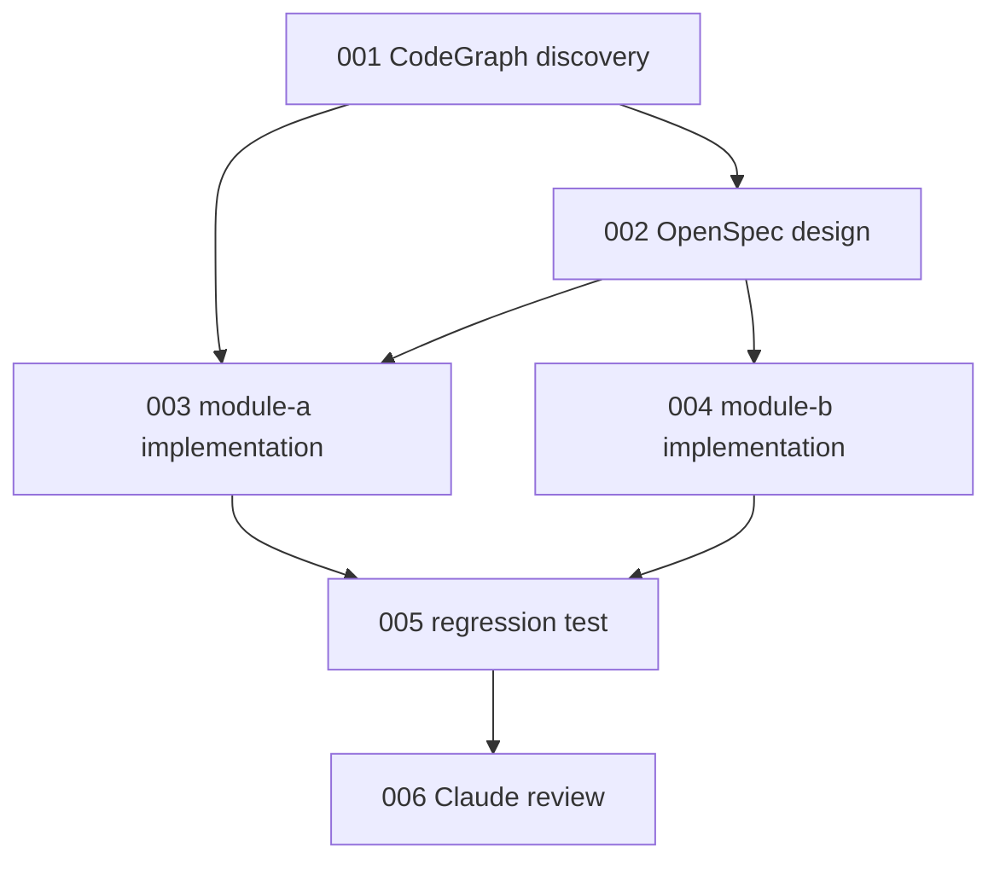

# dependencies.md

## 使用说明

本文件记录多 Agent 重构任务依赖关系。第一版只作为 Leader 调度依据，不做自动 DAG scheduler。

状态只允许使用：

```text
pending / ready / running / blocked / failed / retrying / done / accepted / abandoned
```

只有上游任务全部 `accepted` 后，下游任务才能进入 `ready`。

`concurrency_group` 语义：

- 留空或 `null`：不受并发组限制，可在 `file_locks` 不冲突时并行。
- 填写名称：必须在 `workflow-config.yaml` 的 `concurrency_groups` 中存在，并按 `max_parallel` 限制执行。
- `max_parallel: 1`：同组任务串行。
- Leader 如需临时放宽并发限制，必须在 `decisions.md` 记录原因、风险和补充验证。

## 任务依赖表

| task-id | task-name | blocked_by | unblocks | acceptance_required | status | owner | priority | concurrency_group |
|---|---|---|---|---|---|---|---|---|
| 001 | CodeGraph discovery | - | 002,003 | yes | pending |  | high | discovery |
| 002 | OpenSpec design | 001 | 003,004 | yes | pending |  | high | contract-design |
| 003 | module-a implementation | 001,002 | 005 | yes | pending |  | normal | module-a |
| 004 | module-b implementation | 001,002 | 005 | yes | pending |  | normal | module-b |
| 005 | regression test | 003,004 | 006 | yes | pending |  | high | verification |
| 006 | Claude review | 005 | - | yes | pending |  | normal | review |

## 数据流和契约

| task-id | inputs | outputs | contracts |
|---|---|---|---|
| 001 | PRD, OpenSpec, CodeGraph | 入口、调用链、影响面 | 受影响模块清单 |
| 002 | 001 result, PRD | proposal/design/tasks/specs | API/DTO/SQL/配置约束 |
| 003 | 001 result, 002 contracts | 模块 A patch, 单测 | 模块 A 行为边界 |
| 004 | 001 result, 002 contracts | 模块 B patch, 单测 | 模块 B 行为边界 |
| 005 | 003 result, 004 result | 测试报告, 缺口清单 | 回归验证结论 |
| 006 | 005 result, final diff | Claude 审查结果 | 阻塞问题清单 |

## 文件锁

支持精确路径和通配符。两个任务的 `file_locks` 精确相同或通配范围重叠时，必须串行执行。

注意：当前只是文件协议，不是自动锁服务。通配符重叠检测需要 Leader 手动判断，或使用后续辅助脚本检测。

示例冲突：

- `src/main/java/com/example/dto/*.java`
- `src/main/java/com/example/dto/UserDTO.java`

| task-id | file_locks |
|---|---|
| 001 |  |
| 002 | openspec/changes/<change-id>/** |
| 003 | src/main/java/.../ModuleA*, src/test/java/.../ModuleA* |
| 004 | src/main/java/.../ModuleB*, src/test/java/.../ModuleB* |
| 005 | src/test/** |
| 006 |  |

## Mermaid 依赖图



## 调度记录

| 时间 | task-id | 状态变化 | Leader | 说明 |
|---|---|---|---|---|
|  |  | pending -> ready |  |  |
