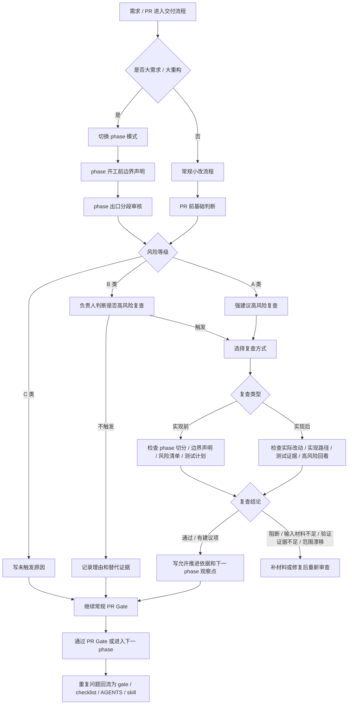

# 大需求分段审核与高风险复查协议

## 文档信息

| 项目 | 内容 |
|---|---|
| 文档状态 | 建议稿 |
| 适用范围 | `asana-openspec-java-workflow` 插件及接入该插件的 Java/Spring/MyBatis 项目 |
| 主要读者 | 插件维护者、Java 后端负责人、技术 Lead、使用 Codex 推进需求交付的开发者 |
| 更新日期 | 2026-06-12 |
| 推荐优先级 | P0：大需求防飘协议的一部分 |

## 文件落点

本文是大需求分段审核与高风险复查的规则源，当前只作为建议稿和软接入协议使用。

相关文件分工：

| 文件 | 作用 | 当前状态 |
|---|---|---|
| `docs/workflow/大需求分段审核与高风险复查协议.md` | 定义 phase 分段审核、触发条件、高风险复查输入合同、结论动作和落地顺序 | 建议稿，已纳入可交付路径 |
| `assets/templates/PR评审清单.md` | PR 阶段实际填写入口，按风险等级条件填写 | 已软接入 |
| `assets/templates/重构RFC模板.md` | 大重构 / phase plan 的实现前边界声明和 A 类风险映射入口 | 已软接入 |
| `assets/templates/分段审核与高风险复查试运行记录.md` | 试运行阶段记录填写成本、触发效果和是否升级门禁 | 已新增 |
| `skills/pr-quality-gate/SKILL.md` | PR Gate 阶段软检查高风险复查字段，后续硬门禁候选位置 | 已软接入，未硬门禁 |

## 执行入口

主流程是大需求识别后的 phase 分段审核，不是高风险复查。高风险复查只是挂在现有交付节点上的风险控制动作。

| 入口 | 触发人 | 填写位置 | 处理方式 |
|---|---|---|---|
| PRD / 需求澄清 | 需求负责人 / 技术 Lead | PRD 风险说明或 OpenSpec 前置记录 | 判断是否可能命中 A 类或 B 类 |
| OpenSpec / RFC | 实现负责人 | `重构RFC模板.md` 或 OpenSpec change | 写 phase 切分、实现前边界声明、A 类高风险链路映射 |
| 实现前 | 实现者 / Reviewer | RFC phase 段或高风险复查记录 | 对 A 类或明显 B 类先做实现前复查 |
| 实现后 / PR 前 | 实现者 | `PR评审清单.md` | 填基础判断，按风险等级补扩展字段 |
| PR Gate | Reviewer / 负责人 | PR 描述和评审清单 | 检查 phase 边界是否收住、是否需要高风险复查、是否有跳过理由、是否可放行 |
| 复盘 / 规则回流 | 负责人 / 插件维护者 | 流程复盘、问题地图、AGENTS、skill | 重复问题或 A 类严重遗漏升级为规则 |

最小入口是 `PR评审清单.md` 的“分段审核与高风险复查（软接入，条件填写）”。大重构入口是 `重构RFC模板.md` 的“实现前边界声明”和“A 类高风险链路映射”。

## 摘要

本文定义大需求、复杂链路和高风险改动下的 phase 分段审核规则，以及必要时触发高风险复查的条件。

分段审核是主流程，高风险复查是可选治理节点。高风险复查不固定依赖 Claude，也不要求所有同事都必须有 Claude：

```text
大需求识别
-> phase 切分
-> phase 开工前写实现前边界声明
-> 实现者完成当前 phase
-> phase 出口做分段审核基础判断
-> 命中 A 类或明显 B 类风险时，负责人判断是否建议高风险复查
-> 按可用工具选择高风险复查承载方式
-> 高风险复查只审范围、边界、风险和证据
-> 通过后继续下一 phase 或进入 PR Gate
```

可用实现方式包括：

- Claude Reviewer。
- 独立 Codex 会话 Review。
- 人工复查。
- 以上方式组合。

一句话：

```text
phase 分段审核负责防止大需求写飘；高风险复查负责在复杂链路上补第二视角。
```

## 流程图



## 设计原则

### 1. 主流程是 phase 分段审核

大需求和大重构先拆 phase，再在每个 phase 开工前写边界声明，phase 出口做分段审核。

高风险复查只在风险、证据或边界不够稳时触发，不替代 phase 拆分、OpenSpec、CodeGraph impact、测试和 PR Gate。

### 2. 触发条件是风险条件，不是工具条件

是否建议高风险复查，取决于改动风险，而不是团队成员是否拥有 Claude。

如果没有 Claude，可以用独立 Codex 会话或人工复查替代。

### 3. 高风险复查默认可选，但高风险场景必须显式说明

大多数需求不强制高风险复查，但当满足触发条件时，交付材料必须写清：

- 是否建议高风险复查。
- 命中的触发条件。
- 若不触发高风险复查，原因是什么。
- 由谁承担继续推进判断。

### 4. 高风险复查字段按风险等级条件填写，避免表格过重

高风险复查字段不是所有 PR 都完整填写。

默认分三层：

- 基础判断：所有 PR 都填写。
- B/A 类扩展字段：大重构、B 类、A 类风险填写。
- A 类强制字段：命中 A 类风险时填写。

C 类小改通常只需要写清风险等级、命中条件、是否建议高风险复查、未触发原因、复查方式和复查结论。

### 5. 高风险复查只做审查，不做二次实现

高风险复查职责是发现漂移和漏链路，不是重新写一遍代码。

重点看：

- 范围是否超出 spec。
- 分层边界是否被破坏。
- 状态流转是否完整。
- DB、权限、幂等、重试、事务是否安全。
- 测试和验证证据是否足够。
- PR 描述是否说明未覆盖风险。

### 6. 高风险复查要基于最小输入合同，不能盲审

触发高风险复查时，不允许只丢一个 diff 或一句“帮我看看有没有问题”。

不同复查类型使用不同输入合同。

通用输入：

- 当前 phase 目标。
- 当前 phase 明确不改范围。
- 对应 PRD / OpenSpec change。
- 如准备继续下一阶段，下一阶段预计触达的链路。

实现前复查输入：

- phase 切分方案。
- 实现前边界声明。
- 当前 phase 预计改动范围。
- CodeGraph 影响预判或人工影响面预判。
- 高风险链路清单。
- 测试计划。
- 回滚计划。

实现前边界声明必须由执行者先写，不由 reviewer 代写：

```md
## 实现前边界声明

- 只改哪些模块：
- 明确不改哪些模块：
- 复用哪些既有能力：
- 风险最高的 3 个点：
- 需要重点验证的测试类型：
```

若命中 A 类条件，实现前复查输入中的“高风险链路清单”必须逐项对应说明本次涉及与否、当前控制方式和剩余风险：

| A 类链路 | 是否涉及 | 当前控制方式 | 剩余风险 |
|---|---|---|---|
| 支付 / 准资金 | 涉及 / 不涉及 / 不确定 |  |  |
| 状态机 / 生命周期 | 涉及 / 不涉及 / 不确定 |  |  |
| webhook / MQ / 回调 / 重试 | 涉及 / 不涉及 / 不确定 |  |  |
| 权限 / 租户隔离 | 涉及 / 不涉及 / 不确定 |  |  |
| DB schema / 批量更新 / 迁移 | 涉及 / 不涉及 / 不确定 |  |  |
| 并发 / 一致性 | 涉及 / 不涉及 / 不确定 |  |  |
| 外部集成 | 涉及 / 不涉及 / 不确定 |  |  |

实现后复查输入：

- 当前 phase 实际改动范围。
- 当前核心实现路径说明。
- 本 phase 关键设计选择说明。
- CodeGraph impact 证据。
- 改动文件清单。
- 测试命令与结果。
- 未覆盖风险。
- 回滚方案或回滚验证结果。
- 高风险链路清单回看。

缺少以上关键输入时，复查结论应优先标记为“输入材料不足”或“验证证据不足”，不得草率通过。

### 7. 高风险复查分为实现前和实现后两类

高风险复查不只在“代码已经做出一段之后”才有价值。

- 实现前复查：看 phase 切分是否合理、边界声明是否清楚、高风险点是否提前识别。
- 实现后复查：看当前实现是否发生范围漂移、结构漂移、输入材料不足或验证证据不足，是否允许进入下一 phase 或 PR Gate。

一句话：

```text
实现前复查负责防走偏，实现后复查负责防带病继续推进。
```

## 高风险复查固定检查面

为了避免不同 reviewer 各审各的，高风险复查默认固定检查四个面。

### 检查面 1：范围

- 是否超出 PRD / OpenSpec 范围。
- 是否出现“顺手修复”“顺手兼容”“顺手重构”等附带改动。
- 当前 phase 是否仍符合原定切分。

### 检查面 2：边界

- Controller / Service / Mapper / job / listener / client 是否越层。
- 状态流转是否仍集中在应集中的位置。
- 事务边界是否清晰。
- 是否绕开既有抽象或复制旧逻辑变体。

### 检查面 3：风险

- DB、权限、幂等、重试、并发、回调、外部集成风险是否说清。
- 是否存在未补偿路径。
- 是否存在不可逆或难回滚改动。

### 检查面 4：证据

- 实现前：CodeGraph 影响预判、测试计划、回滚计划是否足以支撑进入实现。
- 实现后：CodeGraph impact、测试证据、回滚验证或回滚方案是否足以支撑进入下一 phase 或 PR Gate。
- 测试计划或测试证据是否覆盖关键路径，而不只是 happy path。
- PR / phase 描述是否写明未覆盖风险和后续观察点。
- 实现后是否说明当前核心实现路径和本 phase 关键设计选择。

## 高风险复查快速危险信号

命中以下任一项时，B 类风险建议上调一级；A 类风险则应更保守处理：

- 改动文件数明显超出 phase 预期。
- 出现“顺手修复 / 顺手重构 / 顺手兼容”。
- Controller / Service / Mapper 复杂度显著上升。
- 回调、幂等、状态机、事务边界没有专项说明。
- 测试证据只覆盖 happy path。
- 声称“已验证”但无法映射到具体命令、结果或截图。
- Reviewer 看完材料仍无法快速重建改动地图。

## 触发判定流程

高风险复查触发按四步判断：

1. 先看风险等级。
   命中 A 类，默认强建议高风险复查；命中 B 类，建议负责人判断；命中 C 类，通常不需要高风险复查。

2. 再看证据完整度。
   仅当 A 类或 B 类涉及 Java/Spring/MyBatis 行为变更时，证据缺失才触发风险上调。实现前看 CodeGraph 影响预判、测试计划、回滚计划和负责人确认；实现后看 CodeGraph impact、测试证据、回滚验证或回滚方案和负责人确认。A 类未触发高风险复查时，负责人确认必须写明确认人、确认时间和确认依据。

3. 最后选承载方式。
   有 Claude 可以用 Claude Reviewer；只有 Codex 可以用独立 Codex 会话；工具不可用或风险极高时用人工复查。

4. 所有跳过都要留痕。
   命中 A 类或 B 类但不触发高风险复查时，必须写明原因、负责人和替代证据。

## 高风险复查的责任语义

### 负责人确认意味着什么

“负责人确认”不是确认代码绝对没有问题，而是确认：

1. 当前证据已足以支持继续推进。
2. 未触发或跳过高风险复查的风险已知晓。
3. 剩余风险由谁继续跟进明确。

如果负责人无法明确以上三点，不应仅用“已确认”作为放行依据。

A 类未触发高风险复查或接受剩余风险时，负责人确认必须落成可审计字段：

- 负责人确认人：
- 负责人确认时间：
- 负责人确认依据：

### Reviewer 的职责边界

高风险复查 reviewer 负责：

- 发现范围漂移、结构漂移、风险遗漏、输入材料不足、验证证据不足。
- 给出阻断项、建议项、未覆盖风险。
- 判断是否建议进入下一 phase。

但不负责：

- 接手实现。
- 在没有最小输入合同的情况下兜底猜测。
- 替代负责人做最终业务拍板。

## 触发等级

### A 类：强建议触发高风险复查

满足任一条，默认标记为“强建议高风险复查”。如果不触发，需要说明原因。

| 触发条件 | 典型风险 |
|---|---|
| 涉及支付、退款、订单、余额、积分、库存等资金或准资金链路 | 数据错账、重复扣减、不可逆业务损失 |
| 涉及状态机、审批流、生命周期流转 | 状态跳转错误、回滚困难、历史数据不兼容 |
| 涉及 webhook、MQ、异步任务、回调、重试 | 重复消费、顺序错乱、幂等缺失 |
| 涉及权限、认证、授权、租户隔离、数据可见性 | 越权、数据泄漏、误操作 |
| 涉及 DB schema、批量更新、批量删除、数据迁移 | 数据丢失、锁表、线上不可恢复 |
| 涉及事务边界、并发更新、分布式一致性 | 脏写、重复写、部分提交 |
| 涉及外部系统集成、第三方 API、跨服务调用 | 契约变更、失败补偿缺失、调用链断裂 |

A 类不是强制所有情况都高风险复查，但 PR Gate 应按以下规则处理：

- 已执行高风险复查，且无阻断项：可继续按正常 PR Gate 判断。
- 未执行高风险复查，但有负责人确认人、确认时间、确认依据、完整 CodeGraph impact、完整测试证据、回滚方案和未覆盖风险说明：最多 `CONDITIONAL`。
- 未执行高风险复查，且缺少负责人确认人、确认时间、确认依据、CodeGraph impact、关键测试证据或回滚方案任一项：`BLOCKED`。

### B 类：建议视情况触发高风险复查

满足任一条，建议负责人按实际复杂度判断。

| 触发条件 | 判断方式 |
|---|---|
| 改动跨 3 个以上模块或层级 | Controller / Service / Mapper / job / listener / client 多点联动 |
| CodeGraph impact 显示调用链较长 | Reviewer 难以一次还原完整影响面 |
| 一个 phase 内改动文件较多 | PR diff 已经不适合快速人工扫完 |
| PRD、OpenSpec、实现、测试在同一轮内都发生变化 | 需求语义和实现边界可能互相漂移 |
| 测试不能覆盖关键失败路径 | 只能靠人工 reasoning 确认风险 |
| 实现过程中出现“顺手修复”“顺手兼容”“顺手重构” | 范围漂移概率升高 |
| Reviewer 表示看不清链路 | 需要第二视角重建改动地图 |

B 类不触发高风险复查时，应写明判断理由。未写明理由时，PR Gate 最多 `CONDITIONAL`。

### C 类：通常不需要高风险复查

以下场景通常不需要高风险复查，除非负责人另有判断。

| 场景 | 原因 |
|---|---|
| 文案、README、注释、小范围配置说明调整 | 行为风险低 |
| 单文件小 bugfix，且有明确失败测试和修复测试 | 证据链清楚 |
| 非生产路径的样例代码、演示脚本 | 影响面有限 |
| 纯格式化、依赖说明、无行为变化清理 | 不涉及业务语义 |

## 工具选择

### 方案 1：Claude Reviewer

适合已有 Claude 的同事或项目。

使用方式：

```text
按复查类型提供对应输入合同
-> 要求 Claude 只审范围、边界、风险、证据
-> 输出阻断项、建议项、未覆盖风险
```

适合场景：

- 链路复杂。
- 需要独立模型视角。
- 实现者和一审都已经深陷上下文。

### 方案 2：独立 Codex 会话 Review

适合只有 Codex 的同事。

关键要求：

- 使用新的 Codex 会话或清洁上下文。
- 按复查类型提供对应输入合同。
- 明确要求它以 review 视角工作，不继续实现。

推荐提示词：

```md
请只做高风险复查，不修改代码。

审查目标：
- 是否超出 PRD / OpenSpec 范围
- CodeGraph 影响预判或 CodeGraph impact 是否足以支撑影响面判断
- 是否破坏 Controller / Service / Mapper 分层
- 是否遗漏 DB、事务、权限、幂等、重试、并发风险
- 测试计划或测试证据是否足够
- PR 描述是否说明未覆盖风险

输出：
- 阻断项
- 建议项
- 未覆盖风险
- 是否建议进入下一 phase
```

### 方案 3：人工复查

适合工具不可用、风险极高或需要负责人拍板的场景。

人工复查至少看四类材料：

- PRD / OpenSpec 的验收范围。
- CodeGraph 影响预判 / CodeGraph impact 或人工整理的影响面。
- 实现前看 phase 切分、高风险链路、测试计划和回滚计划。
- 实现后看 diff、关键实现路径、测试命令、结果和未覆盖风险。

## 复查结论后的动作协议

高风险复查不是为了产出一段评论，而是为了控制推进节奏。

### 1. 通过

- 可进入下一 phase 或 PR Gate。
- 必须写明允许继续推进的依据。
- 必须写明当前已收住的风险。
- 必须写明下一 phase 重点观察点。
- 仍需保留未覆盖风险说明。

### 2. 有建议项

- 建议项必须记录。
- 负责人判断是本 phase 处理还是后置到下一 phase / PR 后跟踪。
- 若建议项实际涉及高风险链路，应上调处理级别，不得简单忽略。

### 3. 有阻断项

- 不允许进入下一 phase 或 PR Gate。
- 需修复后重新触发高风险复查。
- 如果负责人认为某个阻断项不再阻断，必须先重新分类为“建议项”或“已接受风险”，并记录负责人、原因、补偿措施和后续跟踪方式。
- A 类高风险链路的阻断项默认不能替代放行。

### 4. 输入或验证不足

- 输入材料不足：先补 phase 目标、边界声明、PRD / OpenSpec、CodeGraph 影响预判或 impact、高风险链路清单、未覆盖风险等材料。
- 验证证据不足：先补测试计划 / 测试结果、关键失败路径验证、回滚计划 / 回滚验证、上线观察点等材料。
- 材料补齐前，结论不得按“通过”处理。

### 5. 范围漂移

- 应回到 phase 切分或 OpenSpec 边界重新审视。
- 必要时拆出新 phase，避免把漂移内容直接带进下一阶段。

## phase 出口字段

每个 phase 结束时，建议在交付说明或 PR 描述中增加以下字段。

实际填写时按风险等级分层，不要求 C 类小改补齐全部扩展字段。

```md
## 分段审核与高风险复查

### 基础判断（所有 PR / phase 必填）

- 风险等级：A 类 / B 类 / C 类
- 命中条件：
- 是否建议高风险复查：是 / 否
- 复查类型：实现前复查 / 实现后复查 / 不适用
- 选择的复查方式：Claude Reviewer / 独立 Codex 会话 / 人工复查 / 未触发
- 暂不触发原因：
- 复查记录：
- 复查结论：未执行 / 通过 / 有阻断项 / 有建议项 / 输入材料不足 / 验证证据不足 / 范围漂移

### B/A 类扩展字段（大重构、B 类、A 类填写）

- 当前 phase 目标：
- 当前 phase 改动范围：
- 当前 phase 明确不改范围：
- 实现前边界声明：
  - 只改哪些模块：
  - 明确不改哪些模块：
  - 复用哪些既有能力：
  - 风险最高的 3 个点：
  - 需要重点验证的测试类型：
- 输入合同类型：实现前输入 / 实现后输入
- 高风险链路清单：
- CodeGraph 影响预判 / impact：
- 当前核心实现路径说明（实现后填写）：
- 本 phase 关键设计选择说明（实现后填写）：
- 测试计划 / 测试证据：
- 回滚计划 / 回滚验证：
- 高风险链路清单是否发生变化（实现后填写）：
- 是否新增风险（实现后填写）：
- 实现后剩余风险是否收敛（实现后填写）：
- 输入材料：
- 是否允许进入下一 phase：是 / 否
- 允许继续推进的依据：
- 当前已收住的风险：
- 下一 phase 重点观察点：

### A 类强制字段（命中 A 类填写）

- A 类高风险链路逐项映射：
- 当前控制方式：
- 剩余风险：
- 负责人确认人（未触发高风险复查或接受剩余风险时必填）：
- 负责人确认时间：
- 负责人确认依据：
- 实现前复查记录：
- 实现后复查记录或不做原因：
```

## 高风险复查输出模板

```md
# 高风险复查记录

## 审查输入

- 关联需求：
- 关联 OpenSpec change：
- 关联 PR / diff（实现后填写）：
- 当前 phase：
- 复查类型：实现前复查 / 实现后复查
- 审查方式：Claude Reviewer / 独立 Codex 会话 / 人工复查
- Reviewer：
- 审查时间：
- 当前 phase 目标：
- 当前 phase 改动范围：
- 当前 phase 明确不改范围：
- 实现前边界声明：
  - 只改哪些模块：
  - 明确不改哪些模块：
  - 复用哪些既有能力：
  - 风险最高的 3 个点：
  - 需要重点验证的测试类型：
- 高风险链路清单：
- CodeGraph 影响预判 / impact：
- 当前核心实现路径说明（实现后填写）：
- 本 phase 关键设计选择说明（实现后填写）：
- 测试计划 / 测试证据：
- 回滚计划 / 回滚验证：
- 高风险链路清单是否发生变化（实现后填写）：
- 是否新增风险（实现后填写）：
- 实现后剩余风险是否收敛（实现后填写）：
- 未覆盖风险：

## 结论

- 是否阻断继续推进：是 / 否
- 是否建议进入下一 phase：是 / 否
- 允许继续推进的依据：
- 当前已收住的风险：
- 下一 phase 重点观察点：

## 阻断项

- 问题：
- 类型：范围漂移 / 结构漂移 / 高风险链路 / 测试不足 / 输入材料不足 / 验证证据不足
- 影响：
- 建议修复：

## 建议项

- 建议：
- 原因：
- 是否必须本 phase 处理：

## 未覆盖风险

- 风险：
- 当前判断：
- 后续观察或补测方式：
```

## 和现有 workflow 的接入点

### PRD 阶段

PRD 写作时先判断是否可能进入 A 类或 B 类触发条件。

如果命中，PRD 应写明：

- 是否需要拆 phase。
- 哪些 phase 可能需要高风险复查。
- 哪些风险必须在实现前澄清。
- 是否建议先做实现前复查。

### OpenSpec 阶段

OpenSpec change 应记录：

- 影响模块。
- 状态流转。
- 数据变更。
- 外部调用。
- 验收标准。
- 高风险复查建议。
- phase 切分建议。
- 当前明确不改范围。

### 实现阶段

实现者每完成一个 phase，先自查是否命中触发条件。

不建议连续做完整条链路后才判断高风险复查，否则容易把范围漂移和结构漂移拖到最后。

如果 phase 开始前就已经命中 A 类或明显 B 类风险，建议先做实现前复查，再进入实现。

### PR Gate 阶段

PR Gate 不强制要求所有 PR 都有高风险复查记录，但应检查：

- 是否至少填写基础判断字段。
- C 类小改未填写扩展字段时，是否有清晰未触发原因。
- 命中 A 类条件时是否说明高风险复查处理。
- 命中 B 类条件时是否说明判断理由。
- 未触发高风险复查时是否写明原因。
- 对命中 A 类或明显 B 类风险的需求，是否已有实现前复查记录；若无，是否说明为何可直接进入实现或为何后置到实现后复查。
- phase 切分、实现前边界声明是否在后续实现中被遵守；若偏离，是否回写 OpenSpec 或拆出新 phase。
- A 类未触发高风险复查但证据完整、负责人确认人、确认时间、确认依据和回滚方案明确：最多 `CONDITIONAL`。
- A 类未触发高风险复查且缺少负责人确认人、确认时间、确认依据、CodeGraph impact、关键测试证据或回滚方案任一项：`BLOCKED`。
- B 类未触发高风险复查且未写明判断理由：最多 `CONDITIONAL`。

## 试运行办法

正式升级硬门禁前，先用真实需求试运行。

### 试运行范围

- 1 个 C 类小改：验证基础判断是否足够轻。
- 1 个复杂迁移 slice：验证 B/A 类扩展字段是否够用。
- 3 到 5 个真实大需求：观察触发准确率和团队填写成本。

### 每次试运行记录

```md
## 分段审核与高风险复查试运行记录

- 需求 / PR：
- 风险等级：A 类 / B 类 / C 类
- 命中条件：
- 实际填写耗时：
- 是否触发高风险复查：
- 复查方式：
- 是否发现阻断项：
- 是否发现建议项：
- 是否存在字段过重：
- 是否存在字段不够：
- 是否建议升级模板 / PR Gate：
- 负责人判断：
```

### 通过标准

- C 类小改只填基础判断时，填写成本可接受。
- B 类需求能通过扩展字段说清范围、实现路径、验证证据和继续推进依据。
- A 类需求能通过强制字段说清高风险链路、控制方式和剩余风险。
- Reviewer 能基于材料快速判断 `通过 / 有建议项 / 阻断 / 输入材料不足 / 验证证据不足 / 范围漂移`。

### 升级和回退规则

- 连续 3 到 5 个需求验证字段有效，才考虑将 PR Gate 软检查升级为硬阻断或自动化审计。
- 若字段大量空置，先删减或改成条件字段，不升级硬门禁。
- 若 A 类风险漏检，优先补触发条件或 A 类强制字段。
- 若同类问题重复 2 次及以上，进入规则回流。

## 高风险复查后的规则回流

高风险复查不是一次性评论。重复出现的问题必须回流成规则，避免后续继续靠人记忆。

当同类阻断项、建议项、输入材料不足或验证证据不足问题重复出现 2 次及以上时，应评估是否升级为：

- PR Gate 字段。
- checklist。
- AGENTS 规则。
- skill。
- 问题地图条目。

A 类高风险链路上的严重遗漏，即使首次出现，也可直接提级为 gate、checklist、AGENTS 规则或 skill 候选。

回流记录至少写明：

- 重复问题：
- 出现次数：
- 关联需求 / PR / phase：
- 建议升级位置：
- 负责人：
- 后续验证方式：

## 推荐落地顺序

1. 先把本文作为团队建议稿试运行。
2. 已接入 `assets/templates/PR评审清单.md`、`assets/templates/重构RFC模板.md` 和 `skills/pr-quality-gate/SKILL.md`，作为软字段和软检查使用。
3. 先拿 1 个 C 类小改和 1 个复杂迁移 slice 试填，确认字段不会过重。
4. 在 3 到 5 个大需求中手动填写 phase 出口字段。
5. 观察高风险复查触发是否过度、是否漏掉高风险链路。
6. 稳定后再将 `skills/pr-quality-gate/SKILL.md` 中的软检查升级为硬阻断或自动化审计。
7. 最后再考虑由 Harness Engineering 承载自动提醒和审计记录。

## 不做的事

当前阶段不建议：

- 强制所有需求都高风险复查。
- 强制所有团队成员必须使用 Claude。
- 把高风险复查变成新的实现环节。
- 在没有真实案例前做复杂自动化。
- 把工具可用性当成风险判断依据。

## 下次可直接复用的判断

- 高风险复查是风险触发，不是工具触发。
- Claude 是可选实现，不是强制依赖。
- 只有 Codex 的同事，可以用独立 Codex 会话做高风险复查。
- 高风险链路不一定强制高风险复查，但必须显式说明为什么触发或不触发。
- 高风险复查只审范围、边界、风险和证据，不接手实现。
- 高风险复查字段按风险等级条件填写，C 类小改不背完整大重构字段。
