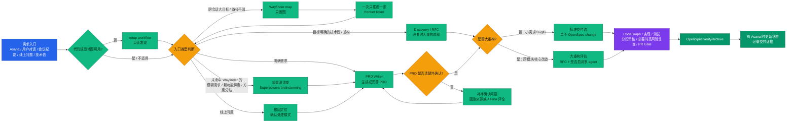
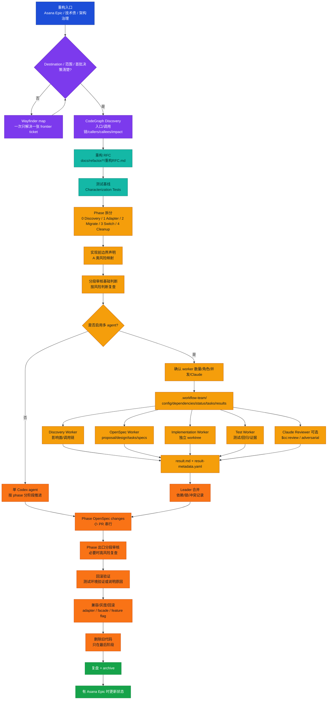
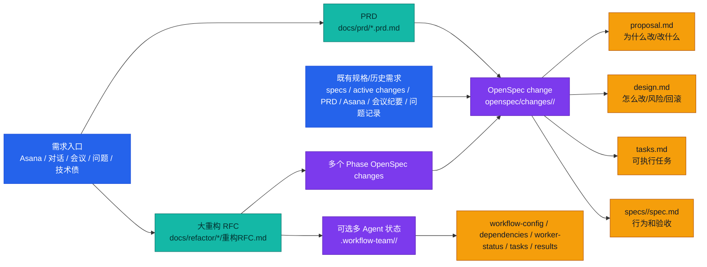

# 多入口需求 + OpenSpec Java Workflow 流程图

## 总览：先分流，再执行

<!-- route-priority: setup > wayfinder > brainstorming -->

硬门槛：

- 模糊需求不能直接实现。
- brainstorming 不能直接替代 PRD / OpenSpec。
- PRD / OpenSpec 未确认，不进入行为变更实现。

## 小需求流程：PRD 到单个 OpenSpec change

```mermaid
flowchart TB
  A["需求入口<br/>Asana / 对话 / 会议 / 问题 / 技术债"] --> R{"是否清楚?"}
  R -- "模糊" --> R1["轻量澄清或<br/>Superpowers brainstorming"]
  R -- "清楚" --> B["PRD md<br/>docs/prd/*.prd.md"]
  R1 --> B
  B --> C{"PRD 是否清楚?"}
  C -- "否" --> C1["待确认问题<br/>回到来源或 Asana 评论"] --> B
  C -- "是" --> C2["人工确认 PRD"]
  C2 --> D0["既有规格检查<br/>specs / active changes / 历史 PRD"]
  D0 --> D["OpenSpec change<br/>proposal/design/tasks/specs"]
  D --> E["影响面定位<br/>CodeGraph 优先<br/>rg/read 降级"]
  E --> F["Coding Discipline<br/>假设/范围/不做/验证"]
  F --> G["Plan Review<br/>任务拆分/风险/测试策略/回滚"]
  G --> G0["分段审核基础判断<br/>风险等级/是否建议高风险复查"]
  G0 --> G1{"实现复杂 / 多文件多步骤?"}
  G1 -- "是" --> G2["可选 Superpowers writing-plans<br/>拆文件/步骤/测试/提交"]
  G1 -- "否" --> H["Codex 实现<br/>按 tasks.md 小步推进"]
  G2 --> H
  H --> I["Java Test Strategy<br/>执行单测/集成/手动验证"]
  I --> J["CodeGraph impact<br/>改动影响面复查"]
  J --> K0["PR 前分段审核<br/>B/A/大重构补扩展字段"]
  K0 --> K1{"是否需要高风险复查?"}
  K1 -- "是" --> K2["高风险复查<br/>范围/边界/风险/证据"]
  K1 -- "否" --> K["Review Gates<br/>Java/Security/SQL Performance/MySQL/Quality"]
  K2 --> K
  K --> L{"是否通过?"}
  L -- "业务理解错" --> B
  L -- "方案设计错" --> D
  L -- "实现 bug" --> H
  L -- "测试不足" --> I
  L -- "是" --> M["开 PR<br/>需求来源 + OpenSpec + 测试结果"]
  M --> N["合并"]
  N --> O["OpenSpec verify/archive"]
  O --> P["完成后记录<br/>耗时/Review/bug/回退/定位准确性"]
  P --> Q["有 Asana 时标记完成"]

  classDef source fill:#2563eb,color:#fff,stroke:#1d4ed8;
  classDef document fill:#14b8a6,color:#042f2e,stroke:#0f766e;
  classDef analysis fill:#8b5cf6,color:#fff,stroke:#6d28d9;
  classDef build fill:#f97316,color:#111827,stroke:#c2410c;
  classDef review fill:#f59e0b,color:#111827,stroke:#b45309;
  classDef done fill:#16a34a,color:#fff,stroke:#15803d;

  class A source;
  class B,C1,C2,D0,D,R1 document;
  class E,F,G,G0,G2,J,K0,K2 analysis;
  class R,G1,K1 review;
  class H,I build;
  class K,L,M review;
  class N,O,P,Q done;
```

## 大重构流程：Epic + RFC + 可选多 Agent 协作

## 文档产物关系

