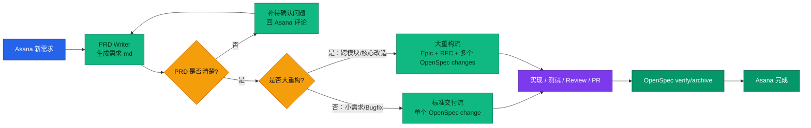
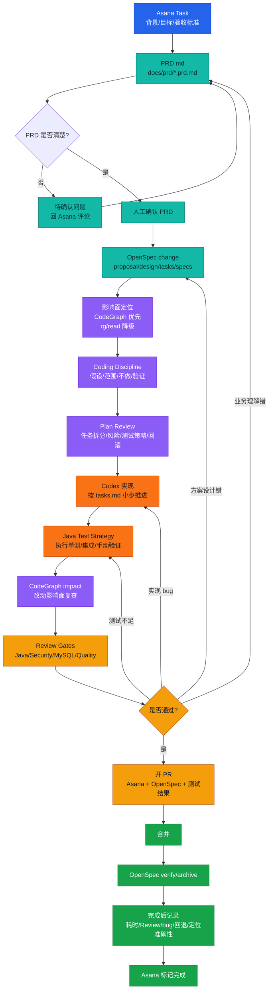
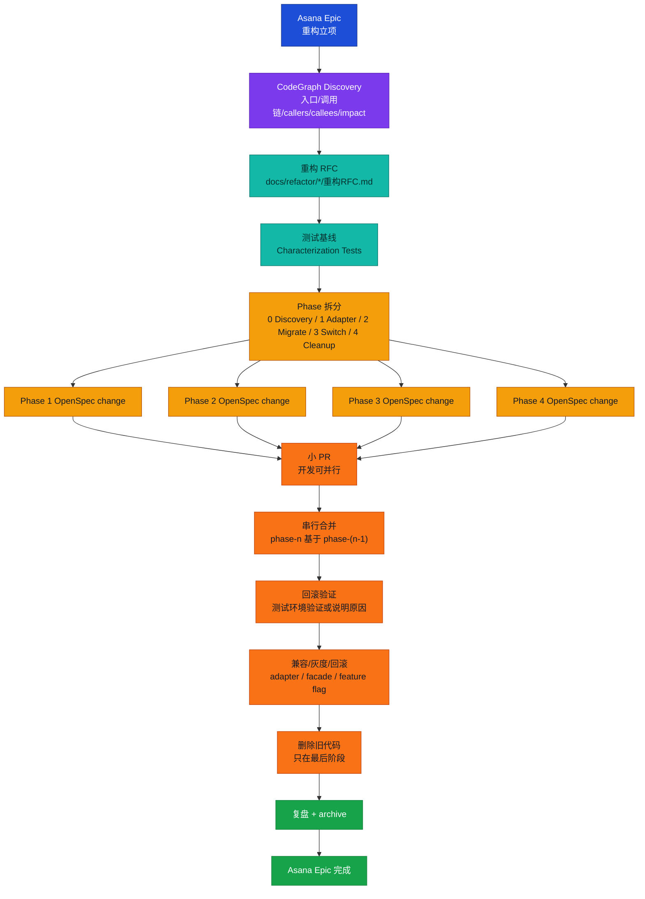
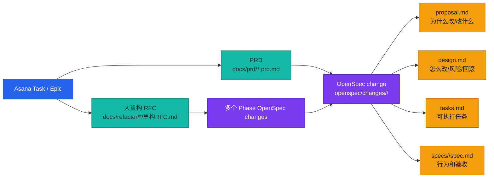

# Asana OpenSpec Java Workflow 流程图

## 总览：先分流，再执行

```mermaid
flowchart LR
  A["Asana 新需求"] --> B["PRD Writer<br/>生成需求 md"]
  B --> C{"PRD 是否清楚?"}
  C -- "否" --> D["补待确认问题<br/>回 Asana 评论"] --> B
  C -- "是" --> E{"是否大重构?"}

  E -- "否：小需求/Bugfix" --> F["标准交付流<br/>单个 OpenSpec change"]
  E -- "是：跨模块/核心改造" --> G["大重构流<br/>Epic + RFC + 多个 OpenSpec changes"]

  F --> H["实现 / 测试 / Review / PR"]
  G --> H
  H --> I["OpenSpec verify/archive"]
  I --> J["Asana 完成"]

  classDef intake fill:#2563eb,color:#fff,stroke:#1e40af,stroke-width:1px;
  classDef decision fill:#f59e0b,color:#111827,stroke:#b45309,stroke-width:1px;
  classDef doc fill:#10b981,color:#052e16,stroke:#047857,stroke-width:1px;
  classDef work fill:#7c3aed,color:#fff,stroke:#5b21b6,stroke-width:1px;
  classDef done fill:#059669,color:#fff,stroke:#065f46,stroke-width:1px;

  class A intake;
  class B,D,F,G doc;
  class C,E decision;
  class H work;
  class I,J done;
```

## 小需求流程：PRD 到单个 OpenSpec change

```mermaid
flowchart TB
  A["Asana Task<br/>背景/目标/验收标准"] --> B["PRD md<br/>docs/prd/*.prd.md"]
  B --> C{"PRD 是否清楚?"}
  C -- "否" --> C1["待确认问题<br/>回 Asana 评论"] --> B
  C -- "是" --> C2["人工确认 PRD"]
  C2 --> D["OpenSpec change<br/>proposal/design/tasks/specs"]
  D --> E["影响面定位<br/>CodeGraph 优先<br/>rg/read 降级"]
  E --> F["Coding Discipline<br/>假设/范围/不做/验证"]
  F --> G["Plan Review<br/>任务拆分/风险/测试策略/回滚"]
  G --> H["Codex 实现<br/>按 tasks.md 小步推进"]
  H --> I["Java Test Strategy<br/>执行单测/集成/手动验证"]
  I --> J["CodeGraph impact<br/>改动影响面复查"]
  J --> K["Review Gates<br/>Java/Security/MySQL/Quality"]
  K --> L{"是否通过?"}
  L -- "业务理解错" --> B
  L -- "方案设计错" --> D
  L -- "实现 bug" --> H
  L -- "测试不足" --> I
  L -- "是" --> M["开 PR<br/>Asana + OpenSpec + 测试结果"]
  M --> N["合并"]
  N --> O["OpenSpec verify/archive"]
  O --> P["完成后记录<br/>耗时/Review/bug/回退/定位准确性"]
  P --> Q["Asana 标记完成"]

  classDef source fill:#2563eb,color:#fff,stroke:#1d4ed8;
  classDef document fill:#14b8a6,color:#042f2e,stroke:#0f766e;
  classDef analysis fill:#8b5cf6,color:#fff,stroke:#6d28d9;
  classDef build fill:#f97316,color:#111827,stroke:#c2410c;
  classDef review fill:#f59e0b,color:#111827,stroke:#b45309;
  classDef done fill:#16a34a,color:#fff,stroke:#15803d;

  class A source;
  class B,C1,C2,D document;
  class E,F,G,J analysis;
  class H,I build;
  class K,L,M review;
  class N,O,P,Q done;
```

## 大重构流程：Epic + RFC + 多阶段交付

```mermaid
flowchart TB
  A["Asana Epic<br/>重构立项"] --> B["CodeGraph Discovery<br/>入口/调用链/callers/callees/impact"]
  B --> C["重构 RFC<br/>docs/refactor/*/重构RFC.md"]
  C --> D["测试基线<br/>Characterization Tests"]
  D --> E["Phase 拆分<br/>0 Discovery / 1 Adapter / 2 Migrate / 3 Switch / 4 Cleanup"]
  E --> F["Phase 1 OpenSpec change"]
  E --> G["Phase 2 OpenSpec change"]
  E --> H["Phase 3 OpenSpec change"]
  E --> I["Phase 4 OpenSpec change"]

  F --> J["小 PR<br/>开发可并行"]
  G --> J
  H --> J
  I --> J

  J --> K["串行合并<br/>phase-n 基于 phase-(n-1)"]
  K --> K1["回滚验证<br/>测试环境验证或说明原因"]
  K1 --> L["兼容/灰度/回滚<br/>adapter / facade / feature flag"]
  L --> M["删除旧代码<br/>只在最后阶段"]
  M --> N["复盘 + archive"]
  N --> O["Asana Epic 完成"]

  classDef epic fill:#1d4ed8,color:#fff,stroke:#1e3a8a;
  classDef discover fill:#7c3aed,color:#fff,stroke:#5b21b6;
  classDef rfc fill:#14b8a6,color:#042f2e,stroke:#0f766e;
  classDef phase fill:#f59e0b,color:#111827,stroke:#b45309;
  classDef pr fill:#f97316,color:#111827,stroke:#c2410c;
  classDef done fill:#16a34a,color:#fff,stroke:#15803d;

  class A epic;
  class B discover;
  class C,D rfc;
  class E,F,G,H,I phase;
  class J,K,K1,L,M pr;
  class N,O done;
```

## 文档产物关系

```mermaid
flowchart LR
  A["Asana Task / Epic"] --> B["PRD<br/>docs/prd/*.prd.md"]
  B --> C["OpenSpec change<br/>openspec/changes/<change-id>/"]
  C --> D["proposal.md<br/>为什么改/改什么"]
  C --> E["design.md<br/>怎么改/风险/回滚"]
  C --> F["tasks.md<br/>可执行任务"]
  C --> G["specs/<capability>/spec.md<br/>行为和验收"]

  A --> H["大重构 RFC<br/>docs/refactor/*/重构RFC.md"]
  H --> I["多个 Phase OpenSpec changes"]
  I --> C

  classDef source fill:#2563eb,color:#fff,stroke:#1d4ed8;
  classDef prd fill:#14b8a6,color:#042f2e,stroke:#0f766e;
  classDef spec fill:#7c3aed,color:#fff,stroke:#5b21b6;
  classDef file fill:#f59e0b,color:#111827,stroke:#b45309;

  class A source;
  class B,H prd;
  class C,I spec;
  class D,E,F,G file;
```
